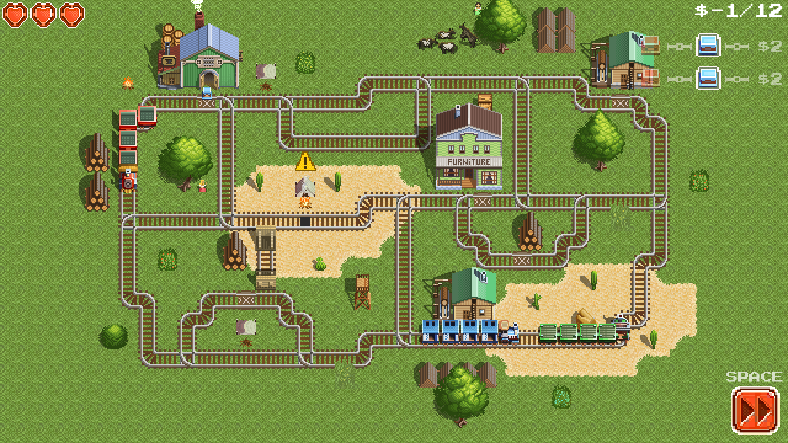

## About

Pixel Express is a game about managing trains. It can be classified as an arcade game with pixel-art graphics. Each chapter has its own setting. For example, first chapter is set in Wild West.

## Screenshots

Gameplay (YouTube link)

## FAQ

- What is the current state of the game?
  - In active development. No public build available yet.
- What are the target platforms for the game?
  - All popular desktop and mobile platforms (Win, Mac, GNU/Linux, Android, iOS).

## Contacts

We are still working on our corporate contacts!
